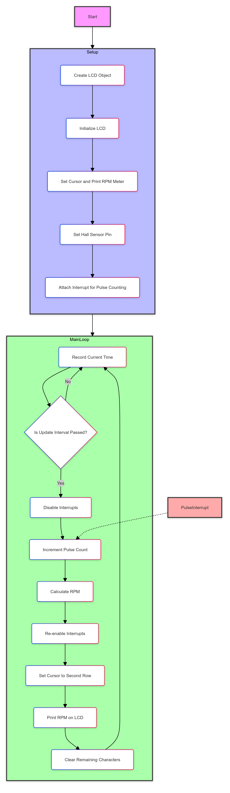
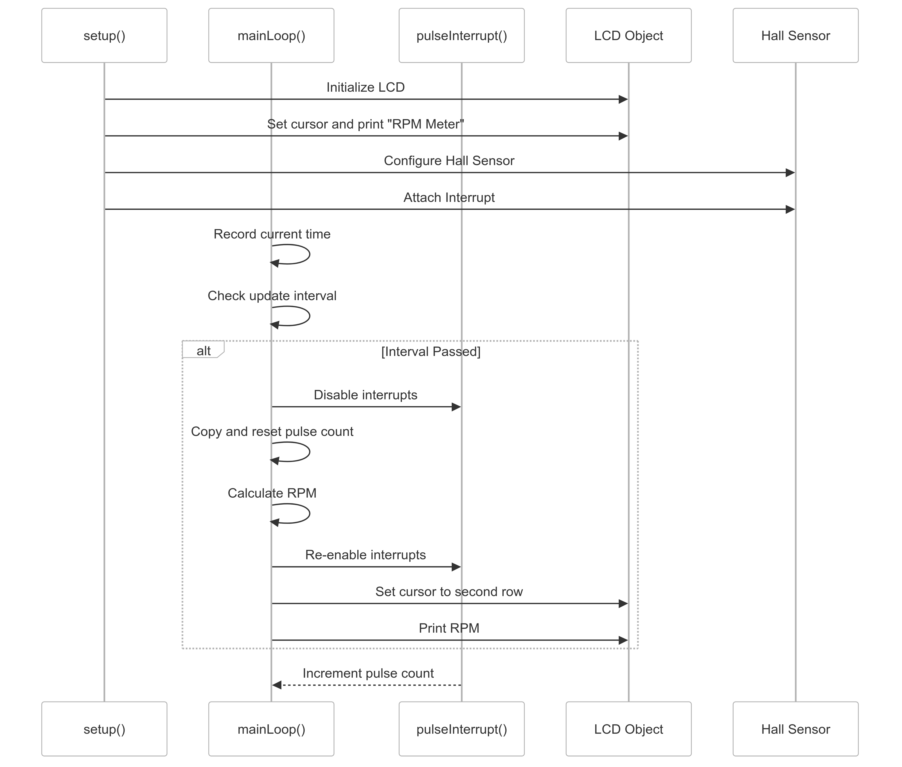

# RPM Meter Project

## Overview

This project implements a digital RPM (Revolutions Per Minute) meter using an Arduino-compatible microcontroller, a Hall effect sensor, and an I2C LCD display. The system measures the rotational speed of a shaft or wheel and displays the RPM in real-time on the LCD screen.

## Features

- Real-time RPM measurement
- LCD display for easy reading
- Interrupt-driven pulse counting for accuracy
- Regular updates at 1-second intervals

## Components Required

1. Arduino-compatible microcontroller (e.g., ESP32, Arduino Uno)
2. Hall effect sensor (e.g., A3144)
3. I2C LCD display (16x2 characters)
4. Magnet (for triggering the Hall sensor)
5. Breadboard and jumper wires
6. 10k resistor (if pull-up is not enabled in software)

## Pin Connections

- Hall Sensor Output -> Pin 2 (Interrupt pin)
- I2C LCD SDA -> SDA pin of microcontroller
- I2C LCD SCL -> SCL pin of microcontroller
- Connect appropriate power (VCC) and ground (GND) for all components

## Software Dependencies

- Wire.h library (usually comes pre-installed)
- LiquidCrystal_I2C library

To install the LiquidCrystal_I2C library:
1. Open the Arduino IDE
2. Go to Sketch -> Include Library -> Manage Libraries
3. Search for "LiquidCrystal I2C"
4. Install the library by Frank de Brabander

## Setup Instructions

1. Connect the components according to the pin connections described above.
2. Install the required libraries.
3. Copy the provided code into your Arduino IDE.
4. Verify and upload the code to your microcontroller.

## Configuration

You may need to adjust the following parameters in the code:

- `HALL_SENSOR_PIN`: The pin number where the Hall sensor is connected (default is 2)
- `LCD_ADDRESS`: The I2C address of your LCD display (default is 0x3F, but might be 0x27 for some displays)
- `UPDATE_INTERVAL`: The interval in milliseconds between RPM updates (default is 1000ms)

## Usage

1. Power on the system.
2. The LCD will display "RPM Meter" on the first line.
3. Attach the magnet to the rotating shaft or wheel you want to measure.
4. Position the Hall sensor so that the magnet passes close to it during rotation.
5. The second line of the LCD will display the current RPM, updating every second.

## How It Works

1. The Hall sensor detects each pass of the magnet, triggering an interrupt.
2. The interrupt function increments a pulse counter.
3. Every second, the main loop calculates the RPM based on the number of pulses counted.
4. The RPM is then displayed on the LCD.
5. The pulse counter is reset for the next measurement cycle.

## Troubleshooting

- If the LCD doesn't display anything, check the I2C address and connections.
- If RPM readings are inaccurate:
  - Ensure the magnet is passing close enough to the Hall sensor.
  - Check that the UPDATE_INTERVAL is set correctly.
  - Verify that the Hall sensor is working correctly with a simple LED test circuit.

## Customization

- To change the update frequency, modify the `UPDATE_INTERVAL` constant.
- For different LCD sizes, adjust `LCD_COLUMNS` and `LCD_ROWS` constants.
- To measure speeds of multi-pole systems, adjust the calculation in the `updateRPM()` function.

## Flowchart and sequence

## License

This project is open-source and available under the MIT License.

## Contributing

Contributions to improve the project are welcome. Please feel free to submit pull requests or open issues for bugs and feature requests.